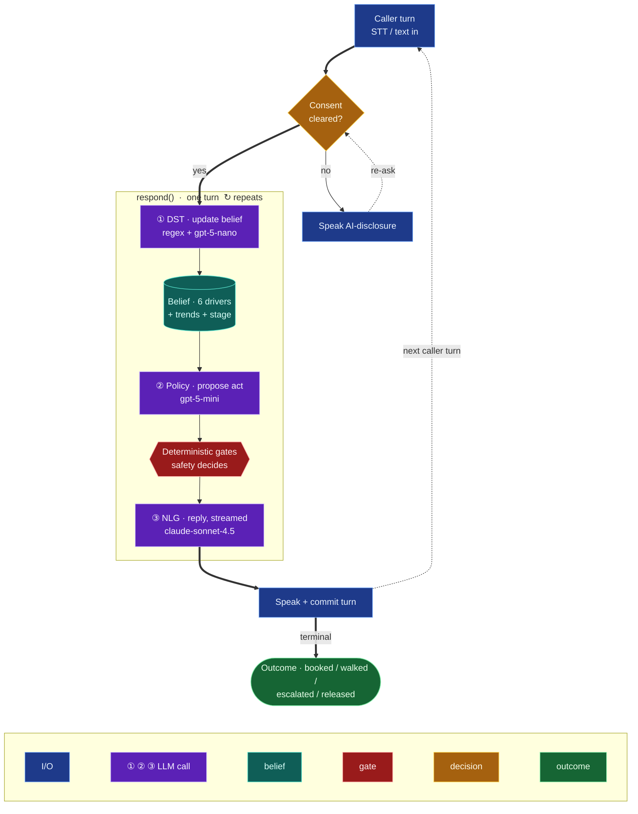

# Autonomous Sales Agent — Per-Conversation Update Loop

> How the agent processes **one caller turn** — update belief, decide an action, speak — repeated
> every turn until the call reaches a terminal outcome. The brain is transport-agnostic
> (`src/core/respond.py`): the **same** code runs the live voice worker and text self-play
> (**R37 parity** — no LiveKit type crosses into `src/core`).
>
> Neuro-symbolic contract: **the LLM proposes, deterministic gates decide.** Three LLM calls per turn
> — ① DST, ② Policy proposer, ③ NLG — and only ③ generates words.

## The loop (core)



## Inside the gates (detail / zoom-in)

`apply_gates()` runs the LLM's proposed act through an ordered chain of pure, deterministic gates
that have **final say** — the live transcript proved the LLM will not reliably self-police, so
safety/correctness lives here, not in the prompt.


## Notes

- **Three sequential LLM calls per turn** (the latency budget): DST `gpt-5-nano` → Policy proposer
  `gpt-5-mini` → NLG `claude-sonnet-4.5` (all via OpenRouter). NLG is the only generative call and is
  **streamed to TTS** (CB-41) so the first audible word lands at NLG first-token.
- **Belief is Markov + frame-stacked:** the 6 driver *levels* (trust, urgency, bail_risk,
  need_intensity, purchase_intent, price_sensitivity) plus their *velocities* (deterministic deltas)
  let the Policy see direction-of-travel without unbounded history.
- **Buy-gate purity:** a commitment is immutable to talk — it fires only when the agent runs
  `attempt_close` at a tier the prospect's budget + qualification actually support. The agent cannot
  "talk its way" to a sale.
- **Returning caller:** phone → sha256 hash (raw phone never stored) → prior lead hydrates slots so
  `skip_known` won't re-ask, with sticky prior objections.
- **R37 parity:** this exact loop is what `tests/integration/test_voice_sim.py` (roomless voice) and
  text self-play both exercise — voice changes only *delivery* (STT/TTS/streaming), never decisions.
- **Out of scope here:** the separate *self-improvement* loop (generator → experiment →
  bootstrap-CI grading → sim-to-real divergence gate → promotion) runs across many conversations.
- **[Experimental, CB-42]** a distilled-ML variant replaces the DST `gpt-5-nano` call with a local
  MLP driver-delta regressor and the Policy `gpt-5-mini` proposer with a confidence-gated ML
  classifier (same gate chain, NLG stays the streamed LLM) — ~3→1.1 LLM calls/turn. Lives on the
  `cb42-ml-distill` branch, not this (production) path.

<!-- Rendered reference: experiments/cb42 render pipeline produced /tmp/mmd/loop_v3.png during design. -->
```
