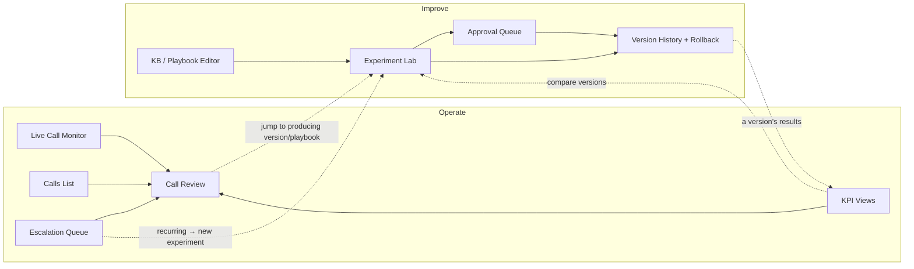

# Dashboard UI/IA Spec — internal design input (not a deliverable)

**Purpose:** the single source a designer (human or agent) reads to draft mocks of the operator dashboard — every page, the features on each page, the states each page has, and the transitions between pages. **Secondary job:** it pins *what each page reads*, which is the data contract the backend logging/episode schema (plan U2) must emit — so writing this before U2 locks prevents retrofitting.

Scope: the **operator dashboard** (one app, two modes: Operate / Improve). The prospect-facing **demo surface** (web-voice + text console) is a separate surface, noted at the end. Source requirements: R10, R12, R25–R27, R34, R44, plus the design-review IA findings (live-monitor signal priority, two-mode nav, queue lifecycle, experiment-lab states, KPI-views IA).

This is a *what/where* spec, not visual design — colors, type, spacing are the designer's call.

---

## Actors & shell

- **One role: the Operator** (you). No multi-tenant, no auth tiers in v0.
- **App shell:** persistent left nav with a top-level **mode switch (Operate / Improve)**. Default landing = **Operate › Live** (falls back to **Operate › Calls** when no call is active).
- **Global, always-visible:** the current **champion version** selector (+ link to Version History), the agent **persona/voice** indicator, and an environment badge (sim vs live).
- **Cross-mode jump (key flow):** from a flagged call or metric in Operate, jump straight to the experiment / playbook in Improve that addresses it (and back).

---

## Page transition map

---

## OPERATE mode

### P1 — Live Call Monitor
Watch an in-progress call in real time and decide whether to step in.
- **Features:** streaming transcript; **belief-state panel with strict priority** — *primary (always visible):* trust, bail_risk, current stage + last system act, an "escalation-imminent" flag; *secondary (expand on demand):* full slot table w/ confidences, all latent drivers + trends; current decision + one-line rationale; talk-listen meter; **manual "Take over" control**.
- **Reads:** live per-turn stream `{transcript, decision, belief snapshot, latency}` keyed by turn id; version + kb_version tags.
- **States:** no-active-call (empty) · active · call-ending · takeover-engaged.
- **Transitions:** → P2 Call Review (on call end, or selecting a past call); Take over → takeover-engaged → back to monitor or call end.

### P2 — Call Review (a completed call)
Inspect one finished call end to end.
- **Features:** full transcript; per-turn **decision trace** (next-Q / pivot / escalate + rationale); **belief-trajectory replay** (scrub turn by turn); outcome + ladder tier + qualified/disqualified; version + kb_version; "jump to the version/playbook that produced this".
- **Reads:** one stored episode (full schema).
- **States:** loading · loaded · not-found.
- **Transitions:** ← from P1 / P3 / P5; → Improve (P6/P8 via the producing version).

### P3 — Calls List
Browse and filter calls.
- **Features:** filters (version, cohort, outcome/tier, qualified?, escalated?, date); columns (time, outcome/tier, version, flags); search.
- **Reads:** episode index (summary fields).
- **States:** empty · list · filtered-empty.
- **Transitions:** → P2 (row).

### P4 — KPI Views
Judge a version's performance, per version & cohort.
- **Features:** **priority tiles (primary):** weighted-ladder score · **same-call enrollment rate (distinct)** · qualification accuracy · guardrail status (hallucination / pushiness / false-promise). **Secondary grouped panels:** ladder-tier breakdown; objection-recovery (overall + per type); escalation rate; disqualification rate; talk-listen; avg turns/duration; slot/discovery completeness; per-archetype conversion; time-to-pivot; abandon timing; per-stage dwell (the R34 set). **Version/cohort selector + compare-two-versions.**
- **Reads:** aggregated metrics per version/cohort.
- **States:** no-data · single-version · compare.
- **Transitions:** → P2 (drill into the calls behind a number); → P6 (compare → open the experiment).

### P5 — Escalation Review Queue
Post-hoc review of deferred/extreme moments (no live action — the agent already deferred).
- **Features:** items (call, the moment, reason: concession / human-request / compliance); **lifecycle: unreviewed → reviewed/resolved**; actions (acknowledge, annotate, send-to-experiment, dismiss); sort by recency/severity; empty state.
- **Reads:** escalation-log entries linked to episodes.
- **States:** empty · items · item-detail.
- **Transitions:** → P2 (open the call); → P6 (recurring escalation → new experiment).

---

## IMPROVE mode

### P6 — Experiment Lab
Run and watch champion-vs-challenger.
- **Features:** experiment list with **states: running · passed→auto-promoted · blocked→pending-approval · failed · retired**; per-experiment **before/after view** (KPI delta + significance/CI + guardrail status + the *declared minimal diff*); launch (pick dimension, define/seed variant, set population slice); promote/retire.
- **Reads:** experiment runs + episode batches + grading results + version lineage.
- **States:** none · running · result-ready · blocked.
- **Transitions:** → P7 (blocked); → P9 (after promote); ← from P4/P5.

### P7 — Approval Queue (extreme promotions)
The human gate for extreme challengers.
- **Features:** pending items (reason: guardrail tripwire / pricing-concession / persona-overhaul), before/after evidence, approve/reject + note.
- **States:** empty · pending.
- **Transitions:** approve → promote (→ P9); reject → back to P6.

### P8 — KB / Playbook Editor
Author grounding + playbooks.
- **Features:** edit KB (programs, membership pricing, policies, competitor differentiators, 9-objection rebuttals) and playbooks (SPIN sequencing, rebuttal maps, close triggers) and thresholds; **a save creates a draft *challenger*, never a live champion mutation**; kb_version bumps on KB edits; diff vs current champion.
- **States:** viewing · editing-draft · draft-saved.
- **Transitions:** save → P6 (test the draft); → P9.

### P9 — Version History + Rollback
Lineage and champion control.
- **Features:** champion **lineage tree** (parent links); each version's config snapshot + kb_version + KPI record; current-champion marker; **one-click rollback**; version-to-version diff.
- **Reads:** version lineage + per-version KPI.
- **States:** tree/list · version-detail · rollback-confirm.
- **Transitions:** → P4/P6 (a version's results); rollback → sets champion.

---

## Data contract this implies (feeds plan U2 / logging)

The backend must emit, so these pages have something to read:
- **Per-turn record:** transcript text, system decision + rationale, belief snapshot (slots+conf, latent drivers, trends), latency, turn id — for P1/P2.
- **Episode record:** the above sequence + outcome + ladder tier + qualified/disqualified + version + kb_version + channel — for P2/P3.
- **Escalation log:** episode link + moment + reason + lifecycle state — for P5.
- **Aggregated metrics:** the full R34 set, grouped per version & cohort — for P4.
- **Version lineage:** version → parent, config snapshot, kb_version, KPI record, champion flag — for P6/P9.

If any page above needs a field the episode schema doesn't carry, U2's schema is wrong — fix it before building U2.

---

## Open questions for the designer
- Live-monitor density: how much belief-state to show by default before the operator feels overwhelmed (the priority list above is the proposed default).
- Compare-two-versions UX on P4/P6 (side-by-side vs overlay).
- Whether P3 Calls List and P5 Escalation Queue share a table component.

## Out of scope here
- The **prospect-facing demo surface** (web-voice call + text console, R1/R13) is a *separate* surface, not part of Operate/Improve — it's the call UI the prospect sees. Style it only if the demo needs polish; the operator dashboard is the priority of this spec.
- Visual design (color/type/spacing/motion), responsive behavior, theming — the designer's call.
