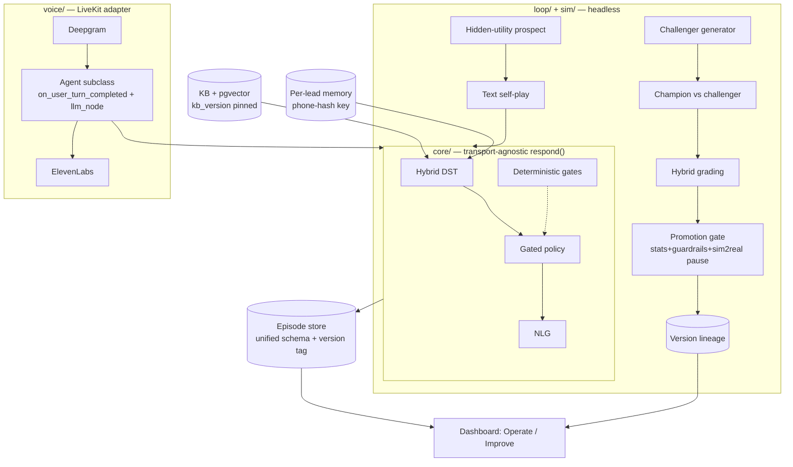

# feat: Autonomous Voice AI Sales Agent — End-to-End Build

## Summary

Build a greenfield, fully-autonomous web-voice AI sales agent for tutoring (Nerdy / Varsity Tutors): a belief-state dialogue brain that runs discovery-to-commitment calls, grounds answers in a knowledge base, remembers callers across calls, and improves itself through a batch self-play loop against honest hidden-utility synthetic prospects — observable and operable from an Operate/Improve dashboard. The build is sequenced text-core → improvement loop → voice → dashboard → docs, so the gradeable heart (the loop moving a real KPI) is provable before voice is added. The single most important architectural commitment is a **transport-agnostic `respond()` core** that both the headless text self-play and the live LiveKit voice session call — so what is optimized in text is exactly what ships in voice.

## Problem Frame

Full motivation, actors, flows, requirements (R1–R44), and success criteria live in the origin requirements doc (`docs/brainstorms/2026-05-31-autonomous-voice-sales-agent-requirements.md`). The central risk this plan must engineer around is the **sim-to-real gap**: an agent can get great at selling to synthetic prospects and fail with real humans. The plan therefore treats sim-to-real validation as a *gate*, not a post-hoc report (R36), and keeps voice-channel artifacts (latency, ASR, barge-in) out of the text-optimization claim (R37).

---

## Key Technical Decisions

- **KTD1 — Language/runtime: Python.** Forced by the locked voice stack (LiveKit Agents is Python-first; OTel observability export is Python-only). No real peer given the lock — chart skipped per policy.
- **KTD2 — Transport-agnostic core (the load-bearing decision).** The brain is a pure async `respond(state, history, user_msg) -> (decision, reply_text, new_state)` with **no LiveKit types**. Voice and text self-play are thin adapters. *(build research; see origin: R5, R37.)* On the voice side, DST + RAG run in LiveKit's `on_user_turn_completed` node (concurrent, pre-generation), and policy + NLG run in the overridden `llm_node`.
- **KTD3 — Datastore: PostgreSQL (with JSONB + pgvector).** One store for episodes, per-lead memory, version lineage, *and* KB vectors.

  | Option | Episodes+JSON state | Vectors | Solo ops cost | Verdict |
  |---|---|---|---|---|
  | **Postgres + pgvector** | JSONB native | pgvector ext | one service | **Pick** — single store, transactional lineage |
  | SQLite + Chroma | JSON ok | separate (Chroma) | lightest local | two stores; weaker concurrency for the loop |
  | Mongo + Atlas vector | native docs | built-in | managed cost | doc model fine, but adds a vendor + less relational for lineage |

- **KTD4 — Vector/RAG index: pgvector** (folds into KTD3). Alternatives Chroma (simplest standalone) / Qdrant (scales hardest) rejected to avoid a second datastore at v0 scale; revisit only if recall/latency demands it.
- **KTD5 — Model split (honest-eval requirement).** Agent brain = **Claude** (Opus/Sonnet) for policy+NLG. Prospect simulator **and** LLM judges = a **different family** (e.g., GPT or Gemini) so sim/judge don't share the agent's blind spots *(see origin: R13, R23)*.
- **KTD6 — STT/TTS: Deepgram Nova-3 (STT) + ElevenLabs Turbo v2.5 (TTS).** Chosen for *consistency* over best-case latency.

  | TTS | P50 TTFA | Jitter (IQR) | Verdict |
  |---|---|---|---|
  | **ElevenLabs Turbo v2.5** | 264 ms | 28 ms | **Pick** — tight, predictable turn-to-turn |
  | Cartesia Sonic-3 | 188 ms | 100 ms | faster median, audible variance — fallback if region tail is acceptable |
  | Deepgram Aura-2 | 313 ms | 68 ms | slowest of the set |

  *(build research; benchmark from our own egress region before locking — published numbers disagree 3–4×.)* STT turn-detection: evaluate Deepgram Flux (`turn_detection="stt"`) vs the local SmolLM turn-detector on real sales-call pauses.
- **KTD7 — Eval/judge: DeepEval (Arena G-Eval, pairwise) + Promptfoo for batch gating.** Pairwise champion-vs-challenger judging is more stable than absolute scoring *(build research)*. Statistical gate uses bootstrap CIs + significance, pinned judge config per experiment.
- **KTD8 — Observability/versioning: Langfuse (OSS) + config-as-code (git).** Langfuse has native LiveKit OTel integration; prompts/playbooks/thresholds/`kb_version` live as git-versioned config stamped into room metadata + `session.userdata` and the `SessionReport`. *(see origin: R12, R26.)*
- **KTD9 — Operator app + demo front-end: Next.js/React (LiveKit JS SDK).**

  | Option | Real-time live monitor | LiveKit reuse | Solo speed | Verdict |
  |---|---|---|---|---|
  | **Next.js + LiveKit JS** | strong (WebRTC + WS) | direct | medium | **Pick** — live-call monitor + the web-voice demo share the SDK |
  | Streamlit | weak (poll-based) | none | fastest | great for analytics-only, poor for a live call surface |
  | Plotly Dash | medium | none | medium | analytics-leaning; no voice path |

---

## High-Level Technical Design

**Component map** (the `core/` package imports no LiveKit; `voice/` is the only LiveKit boundary):



**Per-turn flow (both channels):** `user utterance → DST update (slots + latent drivers + derived trends) + RAG retrieve (concurrent) → gated policy picks system act → NLG streams reply → log {transcript, decision, belief, version, kb_version} keyed by turn id`.

**Loop flow (batch):** `mine scored/tagged episodes → generator proposes minimal-diff challenger → text self-play vs calibrated population → pairwise grade on frozen held-out set + guardrails → promotion gate (significant lift + guardrails clean + qualification accuracy + sim-to-real divergence within threshold) → HOTL-promote (auto, or block if extreme) → new version-tagged champion`.

---

## Output Structure

```
src/
  core/         belief_state.py  dst.py  policy.py  nlg.py  gates.py  respond.py   # NO livekit imports
  kb/           retriever.py  content/                                            # authored KB, versioned
  memory/       schema.py  store.py                                               # episodes + per-lead (phone-hash)
  sim/          prospect.py  personas.py  selfplay.py
  loop/         generator.py  experiment.py  grading.py  promotion.py  validation.py
  voice/        agent.py  session.py  escalation.py                               # ONLY livekit boundary
  config/       settings.py  versions/                                            # config-as-code (git)
  observability/ logging.py
web/            operate/  improve/  demo/                                         # Next.js + LiveKit JS
tests/          unit/  integration/  e2e/
docs/deliverables/                                                                # failure-mode, decision log, etc.
scripts/
```

---

## Implementation Units

### Phase 0 — Foundations

### U1. Repo scaffold + config-as-code
**Goal:** Stand up the Python project, directory structure, and the typed, git-versioned config object (prompts/playbooks/thresholds + `version` + `kb_version`).
**Requirements:** R12. **Dependencies:** none.
**Files:** `pyproject.toml`, `src/config/settings.py`, `src/config/versions/champion_v0.yaml`, `tests/unit/test_config.py`.
**Approach:** Config loads from versioned YAML into a typed object; exposes a stable `version` string. No secrets in git. This object's `version` + `kb_version` are stamped onto every session/episode downstream.
**Test scenarios:** load valid config → typed object with version string; missing required field → clear error; two config files → distinct version strings.
**Verification:** `respond()` and loop can import a versioned config; version string round-trips into an episode record.

### U2. Datastore + unified episode schema
**Goal:** Postgres schema for episodes (real + sim normalized to one shape), per-lead memory, and version lineage.
**Requirements:** R11, R12, R26, R42. **Dependencies:** U1.
**Files:** `src/memory/schema.py`, `src/memory/store.py`, `migrations/`, `tests/integration/test_store.py`.
**Approach:** One `episode` table (transcript JSONB, per-turn decisions JSONB, belief trajectory JSONB, outcome, `version`, `kb_version`, `channel` ∈ {sim,text,voice}). `lead` table keyed by a **hashed phone number** (R42) holding slots/objections/outcome/assigned-voice; raw phone stored separately/securely. Version lineage table (champion/challenger parent links). Validate emitted fields against the dashboard data contract in `docs/design/dashboard-ia-spec.md` so the dashboard (P1–P9) has what it needs without a later retrofit.
**Execution note:** Start with a failing integration test for the episode round-trip contract.
**Test scenarios:** write+read an episode preserves belief trajectory + version tags; lead upsert by phone-hash merges slots; *Covers R26* real and sim episodes share one schema; raw phone never stored in the episode body.
**Verification:** a sim episode and a (stub) voice episode are queryable through one interface with version attribution.

### Phase 1 — The brain (transport-agnostic core)

### U3. Belief-state schema + hybrid DST
**Goal:** The factored belief state (`docs/belief-state-schema.md`) + per-turn hybrid tracker: deterministic slot extraction + LLM latent-driver update + deterministically-derived trend/velocity features.
**Requirements:** R5, R6. **Dependencies:** U1.
**Files:** `src/core/belief_state.py`, `src/core/dst.py`, `tests/unit/test_dst.py`.
**Approach:** Pure functions, no LiveKit. Slots via structured extraction; latent drivers via a rubric-driven LLM delta-update; trends computed from the logged trajectory (Markov-preserving). DST emits a one-line rationale per changed driver (feeds decision log).
**Execution note:** Test-first — the slot/confidence + driver-delta update is core logic.
**Test scenarios:** utterance fills 3 slots in one turn with confidences; value-acknowledgment raises trust, price-shock raises price_sensitivity + lowers trust; trends derived deterministically from a fixed trajectory; garbled/contradictory input does not corrupt high-confidence slots.
**Verification:** given a scripted transcript, the belief trajectory matches expected level + trend values.

### U4. Gated policy + NLG + `respond()` core
**Goal:** The neuro-symbolic policy (LLM proposal + deterministic gates) → NLG, assembled into `respond(state, history, msg) -> (decision, reply, new_state)`.
**Requirements:** R5, R7, R9, R29 (ladder), R35 (SPIN). **Dependencies:** U3.
**Files:** `src/core/policy.py`, `src/core/gates.py`, `src/core/nlg.py`, `src/core/respond.py`, `tests/unit/test_policy.py`, `tests/integration/test_respond.py`.
**Approach:** EFSM stages (greeting→discovery→objection→pitch→close→escalate) as a `stage` field; gates enforce skip-known, must-clear-objection-before-close, escalation triggers, pushiness/max-turn caps. Policy ranks the next act (SPIN-grounded discovery sequencing; commitment-ladder pivot). NLG streams persona-consistent text. **No LiveKit types cross this boundary.**
**Execution note:** Test-first on the gates (they are safety/correctness logic).
**Test scenarios:** *Covers AE2* price raised before trust → policy re-anchors value, does not quote; *Covers AE3* unqualified (no-budget) prospect → graceful release, not a forced close; *Covers AE8* hot prospect → pivots to enrollment, warm prospect → trial/consult; skip-known gate never re-asks a filled slot; objection gate blocks close while an objection is open; pushiness cap fires on repeated pressure.
**Verification:** a full scripted discovery→commitment conversation produces a sensible decision trace and a ladder outcome.

### U5. KB + grounded RAG (with kb_version pinning)
**Goal:** Authored controlled KB + retrieval that grounds answers and pins the KB version per turn.
**Requirements:** R8, R28, R30, R12 (kb pin). **Dependencies:** U2, U4.
**Files:** `src/kb/content/` (programs, membership pricing, policies, competitor differentiators, the 9-objection rebuttals), `src/kb/retriever.py`, `tests/integration/test_grounding.py`.
**Approach:** Markdown/JSON KB → pgvector embeddings tagged with `kb_version`; retrieval returns cited chunks + the version queried (logged per turn). Groundedness enforced: the agent states no fact absent from retrieved KB.
**Test scenarios:** *Covers AE7* competitor question → answer uses only KB differentiators, invents nothing; each of the 9 objections has a grounded rebuttal; a question with no KB support → agent declines/defers rather than fabricating; retrieval logs the `kb_version` used.
**Verification:** groundedness check passes on a battery of policy/competitive/pricing questions; hallucination rate measurable.

### U6. Cross-call memory + skip-when-known
**Goal:** Hydrate per-lead state at call start (phone-hash key) and skip already-known info across calls.
**Requirements:** R2, R7, R11, R42. **Dependencies:** U2, U4.
**Files:** `src/memory/store.py` (extend), `src/core/respond.py` (hydrate hook), `tests/integration/test_memory.py`.
**Approach:** At call start, look up lead by phone-hash; hydrate slots/objections/outcome/assigned-voice; the policy treats hydrated high-confidence slots as known.
**Test scenarios:** *Covers AE1* returning caller → familiarity opener + skips known slots; new caller (no record) → full discovery; partial prior info → fills only the gaps.
**Verification:** a second call from the same phone-hash skips previously captured slots.

### Phase 2 — Honest simulator + improvement loop (gradeable heart)

### U7. Prospect simulator (honest hidden-utility personas)
**Goal:** Prompted personas (different model than agent) with a deterministic buy-gate, ground-truth qualification labels, and a seeded unqualified fraction.
**Requirements:** R13, R14, R31. **Dependencies:** U4.
**Files:** `src/sim/prospect.py`, `src/sim/personas.py`, `tests/unit/test_prospect.py`.
**Approach:** Persona = hidden utility (budget/need/trust/urgency/patience) + RESPER resistance + a hidden qualified/unqualified label + reason; LLM drives talk, but commit/walk is a **deterministic numeric gate** on the drivers (R31). ~20–30% seeded genuinely-unqualified (R14). Persona schema after SalesLLM (propensity/style/decision-factors/difficulty).
**Execution note:** Test-first — the buy-gate determinism is the honesty backbone.
**Test scenarios:** prospect does not "buy" until drivers cross tier thresholds regardless of fluent agent talk; an unqualified (no-budget) persona never commits and signals disqualification; patience exhaustion → walk; population sampling yields the target qualified/unqualified mix.
**Verification:** a fixed persona + fixed agent script yields a reproducible commit/walk outcome.

### U8. Headless text self-play harness
**Goal:** Drive `respond()` vs the simulator at high N with no LiveKit; log episodes to the unified schema.
**Requirements:** R37 (text-substrate), R26. **Dependencies:** U4, U7, U2.
**Files:** `src/sim/selfplay.py`, `tests/integration/test_selfplay.py`.
**Approach:** Plain async loop: prospect ↔ `respond()` to terminal state; write a `channel=sim` episode with decisions + belief trajectory + version + kb_version. Inject realism (terseness, non-answers, ASR-noise corruption) so text-trained behavior is voice-shaped.
**Test scenarios:** a self-play run terminates at a ladder outcome and logs one episode; ASR-noise injection corrupts prospect text without crashing the agent; N parallel runs complete and persist.
**Verification:** a batch of N episodes is queryable with version attribution and outcome distribution.

### U9. Hybrid grading + guardrails
**Goal:** Deterministic groundedness + LLM-judge rubrics (pairwise) gate the loop; guardrail metrics defined; human-calibration sample hook.
**Requirements:** R23, R24, R39. **Dependencies:** U8, U5.
**Files:** `src/loop/grading.py`, `tests/integration/test_grading.py`.
**Approach:** Groundedness = KB-claim check (deterministic). Pushiness/false-promise + "sounds human" = LLM-judge rubrics (DeepEval G-Eval / Arena G-Eval pairwise; judge model ≠ agent model; pinned config per experiment). R39: headline numbers require a minimum human-rated sample size + a judge-vs-human agreement threshold before reporting.
**Test scenarios:** an ungrounded claim is flagged by the groundedness check; pairwise judge prefers a known-better transcript over a known-worse one; guardrail regression (pushiness over cap) is detected; headline metric is withheld until the agreement threshold is met.
**Verification:** grading a champion vs a deliberately-worse challenger ranks them correctly with a confidence interval.

### U10. Improvement loop (champion/challenger + promotion gate)
**Goal:** The batch loop: generate minimal-diff challengers, run experiments, gate promotion (stats + guardrails + qualification accuracy + sim-to-real divergence pause), HOTL-promote, version lineage.
**Requirements:** R16, R17, R18, R19, R20, R21, R22, R36, R29 (qualification accuracy). **Dependencies:** U8, U9.
**Files:** `src/loop/generator.py`, `src/loop/experiment.py`, `src/loop/promotion.py`, `tests/integration/test_loop.py`.
**Approach:** Generator = failure-conditioned (cluster losing episodes) + tactic-mined (winning episodes); LLM-propose for text dims, parametric search for numeric; **minimal-diff containment** (declares one dimension). Experiment = champion vs challenger(s) on a **frozen held-out adversarial set** with periodic rotation; R22 mined failures feed only the training population. Promotion gate: significant lift (bootstrap CI) + guardrails clean + qualification accuracy held + **sim-to-real divergence within threshold else pause (R36)**. HOTL: auto-promote with post-hoc review, block for human approval only on extreme (guardrail tripwire OR pricing-concession/persona) (R19). Mutation surface = prompts+playbooks+thresholds only (R21).
**Execution note:** Test-first on the promotion gate (the integrity-critical logic).
**Test scenarios:** *Covers AE5* non-extreme challenger that clears the bar → auto-promotes with lineage recorded; *Covers AE6* pricing-rebuttal challenger → blocked pending approval; a challenger that wins on the training set but regresses a guardrail → not promoted; a multi-dimension diff → rejected by containment; sim-to-real divergence over threshold → loop pauses; frozen-set rotation excludes R22-mined personas.
**Verification:** a seeded "obviously better" sequencing challenger promotes and becomes the new champion; the before/after is rendered from version-tagged episodes.

### U11. Driver-validation gate
**Goal:** Validate the six latent drivers before policy/experiment depend on them; degrade gracefully if a driver drops; name the fallback experiment.
**Requirements:** R38, R6. **Dependencies:** U3, U8.
**Files:** `src/loop/validation.py`, `tests/integration/test_validation.py`.
**Approach:** Annotate a pilot episode slice (MIND-band + ordinal-intent rubrics), run inter-annotator-agreement + factor analysis; mark drivers that don't separate; gates read only validated drivers; if `trust` fails, the discovery-sequencing experiment falls back to a `price_sensitivity`-grounded one.
**Test scenarios:** a collinear/low-signal driver is flagged and excluded from gating; gates still function with a dropped driver; fallback experiment selectable.
**Verification:** validation report lists kept vs dropped drivers; gates reference only kept drivers.

### Phase 3 — Voice delivery (LiveKit)

### U12. LiveKit voice agent adapter
**Goal:** Wrap `respond()` in a LiveKit `Agent`: DST+RAG in `on_user_turn_completed`, policy+NLG in `llm_node`; STT/TTS; barge-in/turn config; latency safeguards.
**Requirements:** R1, R5, R10 (self-recover), R43. **Dependencies:** U4, U5.
**Files:** `src/voice/agent.py`, `src/voice/session.py`, `tests/integration/test_voice_adapter.py`.
**Approach:** Adapter calls `respond()`; **no LiveKit types leak into core**. Side-effect-safety under preemptive generation (gate writes behind turn-commit — build-research pitfall). Adaptive barge-in; cached filler audio during long KB lookups (R43 latency cover). Per-turn capture keyed by `speech_id`; version + kb_version stamped via room metadata + `session.userdata` + `SessionReport`.
**Patterns to follow:** LiveKit `nodes`, `external-data` (RAG), `adaptive-interruption`, `data hooks` (SessionReport) — see Sources.
**Test scenarios:** voice turn invokes the same `respond()` as text self-play (parity test); barge-in interrupts TTS and updates state; a discarded speculative turn produces no state write; per-turn log joins transcript+decision+version by `speech_id`.
**Verification:** a scripted voice session and the equivalent text session produce the same decisions (the parity guarantee R37 depends on).

### U13. Web voice + text console front-end + consent/PII
**Goal:** The demo surface (LiveKit JS web voice + a text console) and the consent/compliance flow.
**Requirements:** R1 (text console), R3 (persona/2 voices), R33, R40, R41, R42. **Dependencies:** U12, U6.
**Files:** `web/demo/`, `src/voice/session.py` (consent hooks), `tests/e2e/test_demo_call.py`.
**Approach:** Browser web-voice (WebRTC) + a text-chat mode on the same brain. Call opens with **AI disclosure + jurisdiction-aware (all-party) recording consent + refusal path** (R33/R41); **minor detection → parental-consent gate** (R40); transcript bodies PII-scrubbed before the loop, phone-hash retained as the key (R42). Two sticky TTS voices per caller (R3).
**Test scenarios:** *Covers AE9* call opens with AI + recording disclosure, proceeds only on consent; consent refused → proceeds unrecorded or ends per policy; suspected-minor caller → parental-consent gate; returning caller hears their assigned voice.
**Verification:** an end-to-end web-voice discovery-to-commitment call completes with consent captured and a PII-scrubbed episode logged.

### U14. Escalation, manual takeover + sim-to-real harness
**Goal:** Graceful async deferral for extreme moments, optional operator takeover, and the sim-to-real gap measurement.
**Requirements:** R10, R36/R37 (gap), success criteria. **Dependencies:** U12, U10.
**Files:** `src/voice/escalation.py`, `src/loop/sim2real.py`, `tests/integration/test_escalation.py`, `tests/integration/test_sim2real.py`.
**Approach:** Extreme cases → in-persona deferral ("a specialist will follow up") + secure next-best step + log to review queue; operator manual takeover via LiveKit handoff/supervisor (`session.userdata` carries state). Sim-to-real harness runs matched scenarios in sim and voice, computes the divergence the promotion gate (U10) consumes.
**Test scenarios:** *Covers AE4* discount-beyond-band → defers, secures next step, logs escalation, no live human required; operator takeover transfers control with state intact; matched-scenario run produces a sim-vs-voice gap number.
**Verification:** the gap report feeds U10's divergence pause; escalations land in the review queue.

### Phase 4 — Observability dashboard (Operate / Improve)

### U15. Dashboard UI/IA spec + Operate mode
**Goal:** The dashboard UI/IA spec (R44) then the Operate surfaces.
**Requirements:** R25 (Operate), R26, R27, R34, R44, R10 (takeover control). **Dependencies:** U2, U12, U14.
**Files:** `docs/design/dashboard-ia-spec.md` (already written — internal design input, not a deliverable), `web/operate/`, `tests/e2e/test_operate.py`.
**Approach:** Build to the pre-written UI/IA spec (`docs/design/dashboard-ia-spec.md`): live-call monitor with **belief-state IA priority** (trust + bail_risk + current act + escalation-imminent foremost), call review, KPI views (comprehensive R34 set, headline ladder + enrollment-rate distinct), escalation review queue, optional manual-takeover control.
**Test scenarios:** live monitor renders the current call's prioritized belief signals in real time; KPI view filters by version + cohort; escalation queue lists deferred items with lifecycle states; enrollment rate shown distinct from the blended ladder score.
**Verification:** an operator can watch a live call, review a past call's decision trace, and read KPIs per version.

### U16. Improve mode (experiment lab + editors + lineage)
**Goal:** The Improve surfaces: experiment lab, approval queue, KB/playbook editor, version history/rollback.
**Requirements:** R25 (Improve), R19, R20, R12. **Dependencies:** U10, U15.
**Files:** `web/improve/`, `tests/e2e/test_improve.py`.
**Approach:** Experiment lab shows champion-vs-challenger before/after (KPI delta + significance + guardrail status + the declared diff) with running/passed/blocked/promoted states; human-approval queue for extreme promotions; KB/playbook editor whose saves create *draft challengers* (not direct champion mutation); version history + one-click rollback.
**Test scenarios:** an extreme challenger appears in the approval queue and promotes only on approval; a playbook edit creates a challenger draft, not a live change; rollback restores a prior champion; before/after view shows the discovery-sequencing experiment delta (the demo artifact).
**Verification:** the documented before/after on discovery sequencing is viewable end-to-end.

### Phase 5 — Documentation deliverables

### U17. Deliverable docs + demo runbook
**Goal:** The required documentation set.
**Requirements:** origin Deliverables (failure-mode report, recursive-improvement description, decision log, research notes, limitations memo) + demo runbook.
**Dependencies:** U10, U14, U16.
**Files:** `docs/deliverables/failure-mode-report.md`, `recursive-improvement.md`, `decision-log.md`, `research-notes.md`, `limitations-memo.md`, `demo-runbook.md`.
**Approach:** Decision log captures the cold-start priors + gate thresholds (per the brainstorm's honesty rule); limitations memo states the sim-to-real gap honestly + the synthetic-distribution-lift fallback (R-dependencies).
**Test expectation: none — documentation.**
**Verification:** each origin deliverable has a corresponding doc; the recursive-improvement doc shows before/after evidence.

---

## Scope Boundaries

**In scope:** all five phases above (brain → loop → voice → dashboard → docs), per the user's full-end-to-end scope choice.

### Deferred to Follow-Up Work
- Model fine-tuning (prompt/playbook/threshold variants prove the pattern first — R21).
- Outbound-vs-inbound as a *formal experiment dimension* (both channels are built, but only discovery-sequencing is the v0 experiment).
- Phone (PSTN/SIP) channel (web voice is the demo channel); swap synthetic-seed transcripts for the provided corpus when it lands.

**Out of scope (origin):** real CRM integration; WhatsApp; production hardening / multi-tenant; continuous (always-on) self-play; a separately-documented monolithic baseline; pre-committed absolute KPI targets.

---

## Risks & Dependencies

- **Sim-to-real transfer (central risk).** Mitigated by R36 divergence-pause gate (U10), R37 voice-parity test (U12), the sim-to-real harness (U14), and realism/ASR-noise injection (U8). Residual: if the provided transcript corpus never arrives, results are labeled *synthetic-distribution lift* (origin Dependencies).
- **Per-turn latency vs the 3-call chain (R43).** Mitigated by fusing DST+RAG concurrently, off-critical-path state writes, cached filler, and side-effect-safety under preemptive generation (U12). Must benchmark from our egress region (KTD6).
- **Six-driver validation (R38).** The policy/experiment depend on drivers the doc expects 1–2 to drop; U11 gates this before dependence, with a price-sensitivity fallback experiment.
- **Eval integrity.** Pairwise judging + bootstrap CIs + pinned judge config + frozen-set rotation (U9, U10); judge model ≠ agent model (KTD5).
- **Compliance (minors/consent/PII).** U13 gates recording/consent/minor-detection; phone-hash key + transcript scrub (R40/R41/R42). Treat as blocking for any real-human trial.
- **Dependency:** PRD-promised PII-substituted transcript corpus (calibration + tactic-mining); synthetic seed until then.

---

## Open Questions (deferred to implementation)

- Exact statistical test for the promotion gate (significance vs Bayesian vs sequential) — pick during U10 against observed effect sizes.
- Frozen-set size for adequate power vs single-diff effect size (U10).
- Decision-log / episode JSON shape finalization (U2, once real decisions exist).
- Experiment concurrency within a batch (U10).
- STT turn-detection choice (Flux vs local SmolLM) on real sales-call audio (U12).
- New-caller voice-assignment rule before stickiness (U13).
- Minimum human-sample size + judge-agreement threshold concretes (U9, R39).

---

## Sources & Research

- **Origin:** `docs/brainstorms/2026-05-31-autonomous-voice-sales-agent-requirements.md` (R1–R44) and `docs/belief-state-schema.md`.
- **LiveKit build patterns (2026):** node overrides ([nodes](https://docs.livekit.io/agents/build/nodes/)), RAG in `on_user_turn_completed` ([external-data](https://docs.livekit.io/agents/build/external-data/)), handoffs/supervisor ([workflows](https://docs.livekit.io/agents/build/workflows/)), adaptive barge-in ([turns](https://docs.livekit.io/agents/build/turns/)), per-session capture ([data hooks](https://docs.livekit.io/deploy/observability/data/)), latency ([blog](https://livekit.com/blog/understand-and-improve-agent-latency)). Pitfalls: side-effect-safety under preemptive generation; pin `kb_version` per turn; one pure `respond()` core.
- **Self-play / eval:** Deal-or-No-Deal ([end-to-end-negotiator](https://github.com/facebookresearch/end-to-end-negotiator)), ICL-AIF ([arXiv 2305.10142](https://arxiv.org/abs/2305.10142)); DeepEval Arena G-Eval (pairwise) + Promptfoo gating; bootstrap CIs + pinned judge config.
- **STT/TTS latency:** [Gradium TTS benchmark 2026](https://gradium.ai/content/tts-latency-benchmark-2026) (ElevenLabs Turbo 264 ms/28 ms IQR vs Cartesia Sonic 188 ms/100 ms IQR); Deepgram Nova-3 + Flux.
- **Versioning/observability:** Langfuse (OSS, LiveKit OTel) + config-as-code/git; MLflow for eval-run lineage.
